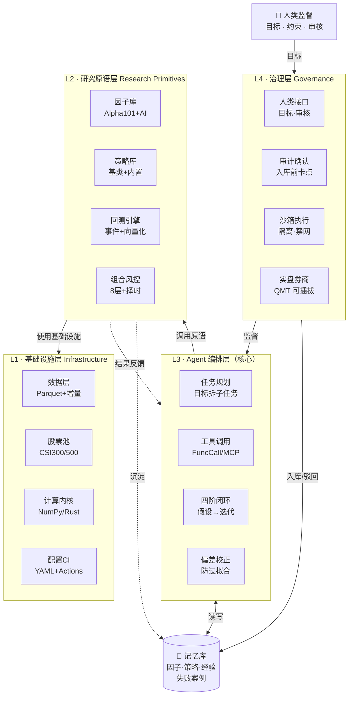

# make_a_deal · Blueprint

> 日线级别 A 股量化分析 · AI 驱动架构设计
> 版本：v2.0（LLM 驱动重构） · 日期：2026-08-28

## 核心理念

**LLM 是研究员，框架是研究工具箱 + 实验台 + 记忆库。**

| 维度 | 传统量化框架 | 本架构（AI 驱动） |
|------|------------|-----------------|
| 设计者 | 人写策略 | LLM 自主生成策略/因子 |
| 框架角色 | 执行人写的策略 | 提供"工具"给 LLM 调用 |
| 闭环 | 一次性跑完 | 假设 → 验证 → 解读 → 迭代 |
| 人 | 设计师 | 审稿人（定目标、审结果） |

融合 QuantGPT 的"AI 自主研究"灵魂、Multi-factor / backtest-engine / etf-rotation 的"专业研究方法论"骨架、china-astock-quant / index_investing 的"工程落地"肌肉，三者合一。

---

## 开发铁律：Defender / Attacker / Judge 三角色对抗

> **任何仓库文件的实施 / 修改 / 优化，都必须经过三轮对抗式评审，缺一不可。**
> 这是本仓库的硬约束，写入 CI 与 PR 模板，违反则 PR 不予合并。

### 角色定义

| 角色 | 立场 | 职责 | 产出 |
|------|------|------|------|
| **Defender（防御者）** | 让方案成立 | 实施代码、修复 bug、写测试、自检通过 | 代码 + 测试 + 自检报告 |
| **Attacker（攻击者）** | 假设方案有缺陷 | 主动找漏洞/边界/失败模式/过拟合/规则遗漏，**每轮至少找出 3 个问题** | 缺陷清单 + 攻击用例 + 反例数据 |
| **Judge（裁判）** | 中立 | 基于 Defender 修复 + Attacker 攻击结果裁决通过/打回 | 裁决结论 + 经验库记录 + 版本升降 |

### 对抗流程（每个 PR / 文件变更必走）

```
Defender 实施+自检  →  Attacker 攻击(≥3问题)  →  Judge 裁决
       ↑                                          │
       └───────── 打回(附攻击清单) ──────────────┘
                                                  │
                                          通过 → 升版本 + 记 changelog
                                          攻击结果入经验库(memory/experience_store)
```

### 量化专项攻击清单（Attacker 必查）

| 攻击面 | 典型缺陷 |
|--------|---------|
| **前视偏差 / 未来函数** | 用了当日收盘才有的数据生成当日信号；财报用报告期而非披露日 |
| **幸存者偏差** | 股票池只含现存股票，未纳入退市/ST 摘帽前样本 |
| **过拟合** | 参数曲线拟合历史；样本内表现远超样本外 |
| **A 股规则遗漏** | T+1 误做 T+0；涨跌停仍可成交；分红除权未复权；ST/停牌未处理 |
| **数据对齐** | 指数成分股用了未来时点；行业分类用了最新版 |
| **费用漏算** | 佣金/印花税/过户费/滑点缺项或比例错 |
| **复权错误** | 前复权后复权混用；回测与因子计算复权基准不一致 |
| **财务数据质量** | 异常值未去极值；缺失未填充；重述数据未用最新版 |

### 约束落地
- PR 模板含三角色 checklist（Defender 自检 ✅ / Attacker 攻击清单 ✅ / Judge 裁决 ✅）
- CI 跑 Attacker 反例测试集（必须失败用例被正确识别为失败）
- 经验库（`src/memory/experience_store/`）记录每次打回的攻击点，避免重蹈
- 三角色可由人担任，也可由不同 LLM Agent 担任（Defender/Attacker/Judge 各一个 Agent，互不知对方提示）

---

## 架构总览



**双闭环要点**：
- **内闭环（L3 ↔ L2，自动、快、预算受限）**：AI 自主跑假设→代码→回测→解读→迭代
- **外闭环（L4 人机共审，慢）**：入库前必审、实盘前二次确认，避免 LLM 幻觉策略进生产
- **记忆库贯穿两环**：内环查/写，外环审核沉淀，失败案例自动入库避免重蹈

---

## 一、吸收的优秀思想（按层归类）

| 思想 | 来源仓库 | 落到哪层 |
|------|---------|---------|
| Parquet 缓存 + 增量更新 | china-astock-quant / index_investing | L1 数据层 |
| 数据源装饰器注册表（可插拔） | quant-trading-system | L1 数据层 |
| 股票池预定义 CSI300/500/50 | china-astock-quant | L1 universe |
| **向量化回测内核**（比事件驱动快 1-2 数量级） | ml-quant-trading | L1 计算内核 |
| Rust 撮合内核（性能瓶颈时） | AKQuant | L1 计算内核 |
| **Alpha101 完整实现 + 论文** | Multi-factor-Model | L2 因子库 |
| 因子清洗流水线（去极值/标准化/行业+市值中性化） | Multi-factor-Model | L2 factor_cleaner |
| 策略基类抽象 + 8 大内置 + 复合投票 | backtest-engine / quant-trading-system | L2 策略库 |
| **事件驱动四阶段** Market→Signal→Order→Fill | backtest-engine | L2 回测引擎 |
| A 股规则完整建模（T+1/印花税/过户费/滑点/100股） | backtest-engine / quant-trading-system | L2 回测引擎 |
| **Brinson 绩效归因** | backtest-engine | L2 回测引擎 |
| **三层验证 WFO→偏差校正→正式回测** | etf-rotation + ml-quant-trading | L2 回测 + L3 偏差校正 |
| 子区间稳定性评估 | china-astock-quant | L2 回测引擎 |
| 投资组合优化（风险平价/最大夏普/最小方差/等权） | index_investing / ml-quant-trading | L2 组合风控 |
| **8 层风控** + 追踪止损 + 涨跌停验证 | easyup-platform / quant-trading-system | L2 组合风控 |
| 市场择时（大盘趋势 + 动态仓位） | stock-analyzer | L2 timing |
| 三种选股组合（并集/交集/加权） | stock-selecter-pro | L2 selector |
| 17 种策略 5 大类 + 多周期共振 | stock-selecter-pro | L2 策略库 |
| **LLM 自主因子工程**（头脑风暴→代码→回测→入库） | QuantGPT | L3 + L2 |
| Agent 闭环（设计→验证→提交） | QuantGPT | L3 四阶闭环 |
| **偏差校正**（ML/LLM 因子过拟合） | ml-quant-trading | L3 bias_correction |
| MCP 协议（多 Agent 环境可调用） | QuantGPT | L3 工具调用 |
| 实盘可插拔（QMT/easytrader） | china-astock-quant | L4 实盘券商 |
| 配置驱动 YAML + GitHub Actions CI | PandOvo / stock-analyzer | L1 配置CI |
| Docker 部署 + Web Dashboard | easyup-platform / quant-trading-system | 工程化 |

---

## 二、四层架构详解

### L1 · 基础设施层（Infrastructure）
- **数据层**：AKShare/Tushare 多源 + Parquet 缓存 + 增量更新，避免重复请求
- **股票池**：CSI300/CSI500/SSE50 预定义，直接用常用指数成分股做 universe
- **计算内核**：NumPy 向量化回测（快 1-2 数量级）+ 事件驱动双模式，性能瓶颈时引入 Rust
- **配置 CI**：YAML 配置驱动 + GitHub Actions 自动测试

### L2 · 研究原语层（Research Primitives）
框架提供的"积木"，可被 LLM 调用，也可被人直接用：
- **因子库**：Alpha101 公式库 + 技术/基本面/量价/动量 + LLM 生成因子
- **factor_cleaner**：去极值、标准化、行业中性化（申万一级）、市值中性化
- **策略库**：策略基类 + 趋势（均线/MACD/布林）/震荡（RSI/KDJ）/形态/复合投票
- **回测引擎**：事件驱动四阶段 + 向量化双模式 + Brinson 归因 + 子区间稳定性
- **组合风控**：风险平价/最大夏普/最小方差/等权 + 8 层风控 + 追踪止损 + 涨跌停验证
- **timing**：大盘趋势判断 + 动态仓位
- **selector**：并集/交集/加权打分 + 全市场 5000+ 扫描

### L3 · Agent 编排层（核心）
- **任务规划器**：把"找到跑赢沪深300的策略"拆成可执行子任务
- **工具调用器**：Function Calling / MCP 调度 L2 各模块
- **四阶闭环**：假设生成 → 代码生成 → 回测验证 → 结果解读+迭代
- **偏差校正器**：识别 LLM/ML 因子过拟合，自动调参或丢弃
- **多 Agent 协作**：研究员 Agent + 风控 Agent + 归因 Agent 分工

### L4 · 治理层（Governance）
- **人类接口**：目标输入（收益/回撤/股票池/时间窗）+ 关键决策确认
- **审计**：新策略入库前人审核，避免幻觉策略进生产
- **沙箱执行**：Docker/子进程隔离，禁网禁写，防 LLM 代码误操作
- **实盘券商**：QMT/easytrader 可插拔接口（可选，回测通过后接券商）

### 记忆库（贯穿 L2-L3）
- **因子库**：LLM 产出的有效因子可复用（类似 Alpha101 但自动生成）
- **策略库**：验证通过、人审核过的策略
- **经验库**：失败案例，避免重复踩坑（"RSI 单因子在熊市失效"等）

---

## 三、研究流程：双闭环 10 步

```
外闭环（人机，慢）              内闭环（AI 自动，快，预算受限）
   │                              │
   ①人定目标 ──────────────────► ②AI 任务拆解
                                  │
                                  ③查记忆库（是否试过相似）
                                  ▼
                                  ④LLM 因子/策略假设
                                  ▼
                                  ⑤LLM 生成 Python 代码
                                  ▼
                                  ⑥沙箱调用回测引擎（事件+向量化双模式）
                                  ▼
                                  ⑦三层验证：WFO → 偏差校正 → 正式回测
                                  ▼
                                  ⑧LLM 读 Brinson 归因 + 子区间稳定性 → 诊断
                                  ▼
                              ┌───┴───┐
                          ⑨迭代改假设    ⑩采纳入库
                          (回④)         │
                                        ▼
   ⑪人审核 ◄────────────────────────── 报告
   │
   入库 / 驳回 ──► 记忆库（成功入库，失败入经验库避免重蹈）
   │
   ⑫可选实盘（可插拔券商 + 全自动盯盘）
```

---

## 四、策略层设计（A/B/C/D 四层流水线）

吸收 stock-selecter-pro 的"策略分层 + 组合模式"和 quant-trading-system 的"复合投票"，组织成 **Alpha → 策略 → 组合/风控 → 选股** 四层：

| 层 | 内容 | 来源吸收 |
|----|------|---------|
| **A. 因子层**（Alpha 来源） | 技术因子(Alpha101) · 基本面(高股息/低估值/ROE/现金流) · 量价形态(红肥绿瘦/放量突破/回调缩量) · 趋势动量(双重动量/海龟) · **LLM 生成因子** | Alpha101 + stock-selecter-pro + QuantGPT |
| **B. 策略层**（信号生成） | 趋势(均线交叉/MACD背离/布林突破) · 震荡(RSI/KDJ) · 形态(横盘突破/筹码) · 复合投票(Dual Thrust+均值回归+海龟) · **LLM 生成策略** | backtest-engine + quant-trading-system |
| **C. 组合/风控层**（执行决策） | 组合优化(风险平价/最大夏普/最小方差/等权) · 多周期共振(日/周/月) · **8 层风控**(仓位/单票/行业/流动性/波动率/相关性/杠杆/日内) · 止损(ATR/百分比/波动/追踪) · 涨跌停验证 · 市场择时 | index_investing + easyup-platform + stock-analyzer |
| **D. 选股层**（信号融合） | 三种组合模式(并集/交集/加权打分) · 全市场 5000+ 扫描器 · 输出候选股票列表 | stock-selecter-pro + stock-analyzer |

**关键设计**：A 层和 B 层都留 **"LLM 生成"** 入口 —— 人写经典因子/策略打底，AI 在其上做增量发现，而不是全靠 AI 从零生成（避免幻觉）。

---

## 五、AI 特有创新（融合 LLM 优势）

| 创新 | 机制 | 价值 |
|------|------|------|
| **自然语言 → 因子/策略** | 人说"低估值高股息抗跌"，AI 转 SQL+因子公式 | 降低使用门槛 |
| **回测结果自然语言解读** | AI 读 Brinson 归因 + 子区间，用人话讲"为什么亏、怎么改" | 替代人工看图 |
| **因子头脑风暴** | 基于市场逻辑 + Alpha101 范式生成新因子公式 | 突破人脑因子库 |
| **偏差校正器** | 识别 LLM/ML 因子过拟合，自动调参或丢弃 | 防回测漂移 |
| **经验库自学习** | 失败案例自动入库，下次生成前查重 | 避免重复踩坑 |
| **多 Agent 协作** | 研究员 Agent + 风控 Agent + 归因 Agent 分工 | 角色分离降错 |
| **MCP 协议化** | 工具暴露为 MCP，可被 Trae/Claude Code/Codex 调用 | 融入开发者工作流 |

---

## 六、目录结构

```
make_a_deal/
├── .trae/skills/make_a_deal/SKILL.md
├── blueprint.md                  # 本文件
├── src/
│   ├── infra/                    # L1 基础设施
│   │   ├── data/                 # Parquet缓存+增量+多源装饰器注册
│   │   ├── universe/             # CSI300/500/50 股票池
│   │   ├── kernel/               # 向量化+事件驱动双模式(Rust可选)
│   │   └── config/               # YAML配置驱动
│   ├── primitives/               # L2 研究原语
│   │   ├── factors/              # Alpha101+技术+基本面+量价+LLM生成
│   │   ├── factor_cleaner/       # 去极值/标准化/行业+市值中性化
│   │   ├── strategies/           # 基类+趋势/震荡/形态/复合
│   │   ├── backtest/            # 事件驱动+向量化+Brinson归因+子区间
│   │   ├── portfolio/           # 风险平价/最大夏普/最小方差/等权
│   │   ├── risk/                # 8层风控+止损+涨跌停验证
│   │   ├── timing/              # 市场择时+动态仓位
│   │   └── selector/            # 并集/交集/加权+全市场扫描
│   ├── agent/                    # L3 编排层(核心)
│   │   ├── planner/             # 任务规划器
│   │   ├── tool_caller/         # Function Calling/MCP
│   │   ├── loop/                # 四阶闭环控制
│   │   ├── bias_correction/     # 偏差校正器
│   │   └── multi_agent/         # 多Agent协作
│   ├── memory/                   # 记忆库(贯穿L2-L3)
│   │   ├── factor_store/
│   │   ├── strategy_store/
│   │   └── experience_store/    # 失败案例
│   ├── governance/              # L4 治理
│   │   ├── human_interface/     # 人类监督接口
│   │   ├── audit/               # 入库前审计
│   │   └── sandbox/             # 沙箱执行(隔离·禁网)
│   ├── execution/                # 实盘(可选)
│   │   ├── brokers/             # QMT/easytrader可插拔
│   │   └── monitor/             # 全自动盯盘
│   └── tools/                    # MCP工具封装(对外暴露)
├── data/                         # Parquet四表(价格/因子/行业/市值)
├── config/ · notebooks/ · tests/
├── dashboard/                    # Web Dashboard
├── .github/workflows/            # CI
└── Dockerfile
```

---

## 七、相比上版方案的关键升级

| 维度 | 上版（纯 AI 闭环） | 本版（融合专业方法论） |
|------|-------------------|----------------------|
| **回测严谨性** | 单次回测即判断 | **三层验证 WFO→偏差校正→正式回测**，AI 因子必须过过拟合关卡 |
| **Alpha 来源** | 全靠 LLM 头脑风暴 | **Alpha101 打底 + LLM 增量发现**，人写经典兜底，AI 补盲区 |
| **研究方法论** | 缺失 | 吸收 **Brinson 归因 + 因子清洗（中性化）+ 子区间稳定性**，让 AI 判断有专业依据 |

---

## 八、实施计划（版本化路线图）

> 每个版本 = 一层/一模块 + 三角色对抗 + changelog 记录。版本号遵循 [SemVer](https://semver.org/lang/zh-CN/)，每版走完 Defender→Attacker→Judge 并由 Judge 通过 → 打 git tag `vX.Y.Z` + 写 changelog.md。

| 版本 | 目标 | 关键任务 | Attacker 重点攻击面 |
|------|------|---------|--------------------|
| **v0.1.0** | 仓库地基 + 开发约束 | changelog/blueprint 三角色章节/CI 骨架/目录骨架 `__init__.py` | 约束遗漏、CI 失效、骨架不完整 |
| **v0.2.0** | L1 数据层 | AKShare/Tushare 多源 + Parquet 缓存 + 增量更新 + universe(CSI300/500/50) | 前视偏差、数据对齐、复权一致性、退市样本 |
| **v0.3.0** | L2 回测引擎(MVP) | 事件驱动四阶段 + A 股规则(T+1/佣金/印花税/过户费/100股/涨跌停) + 均线交叉策略跑通 | 前视、费用漏算、涨跌停可成交、T+1 误判 |
| **v0.4.0** | L2 因子库+清洗 | Alpha101(部分) + factor_cleaner(去极值/标准化/行业+市值中性化) | 中性化错误、异常值、财报披露日 vs 报告期 |
| **v0.5.0** | L2 组合风控+择时 | 8 层风控 + 止损(ATR/追踪) + 市场择时 | 风控穿透、极端行情、仓位溢出、止损跳空 |
| **v0.6.0** | L2 回测增强 | Brinson 归因 + WFO 滚动前进 + 子区间稳定性（三层验证雏形） | 过拟合、参数泄漏、样本外崩塌 |
| **v0.7.0** | L3 Agent 最小闭环 | planner + tool_caller + 四阶闭环(无记忆库) | 幻觉、越权、无限循环、token 失控 |
| **v0.8.0** | L3 偏差校正+记忆库 | bias_correction + factor/strategy/experience store | 经验库污染、误丢弃、相似度误判 |
| **v0.9.0** | L4 治理+沙箱 | sandbox(Docker/子进程隔离) + audit + human_interface | 沙箱逃逸、越权、审核绕过 |
| **v1.0.0** | MCP 工具化+端到端 | tools/ MCP 暴露 + dashboard + 端到端 demo + 文档 | 全量回归、接口契约、安全 |

### 版本节奏约束
- **小步快跑**：每版只做表格内一格，避免大爆炸式合并
- **三角色闭环**：每版必须有三角色对抗记录（Defender 自检 + Attacker ≥3 问题 + Judge 裁决），附在 PR 描述
- **Judge 通过** → 打 git tag `vX.Y.Z` + 更新 changelog.md
- **Judge 打回** → 攻击清单入 `src/memory/experience_store/`，回 Defender 修复后重走后两轮

---

## 九、关键风险与对策

| 风险 | 对策 |
|------|------|
| LLM 生成代码误操作 | **沙箱执行**（Docker/子进程隔离，禁止网络与文件写） |
| 回测过拟合（AI 最易"拟合历史"） | 强制 **WFO 滚动前进验证**，不通过则不入库 |
| Token 成本失控（迭代多） | 单次研究设 **token 预算 + 最大迭代轮数** |
| 决策黑盒 | LLM 每个决策必须附 **理由**，信号输出带可解释性字段 |
| 因子重复造轮子 | 入库前查记忆库，相似度高的不重复生成 |
